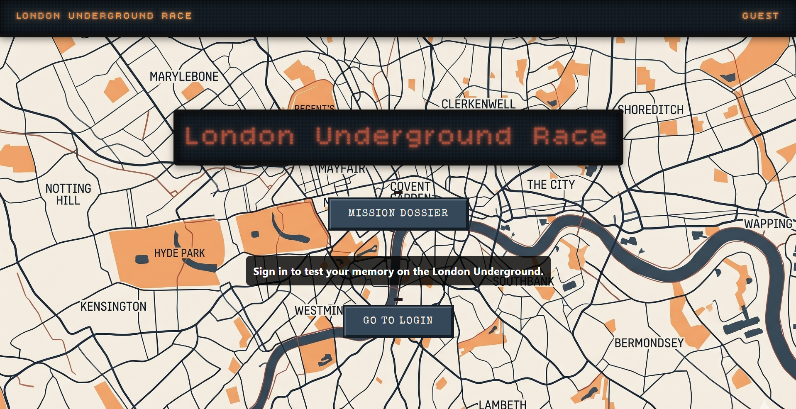
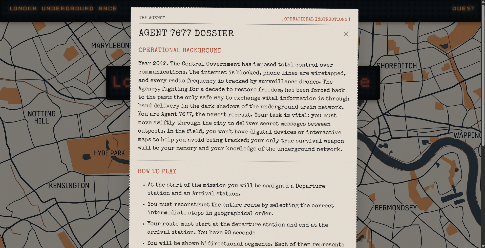
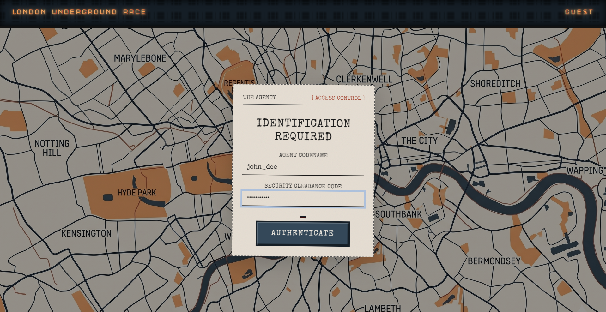
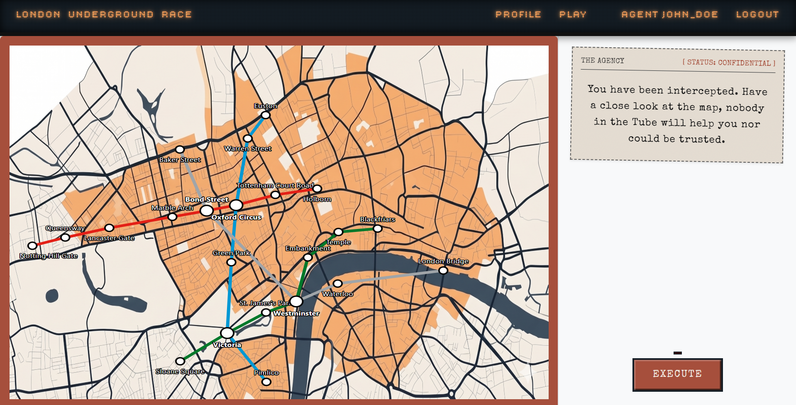
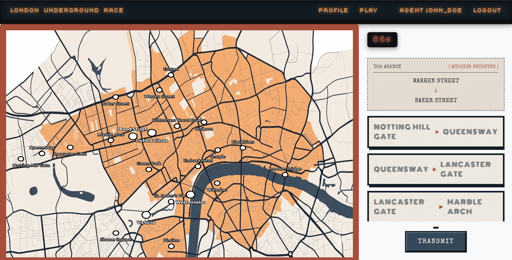
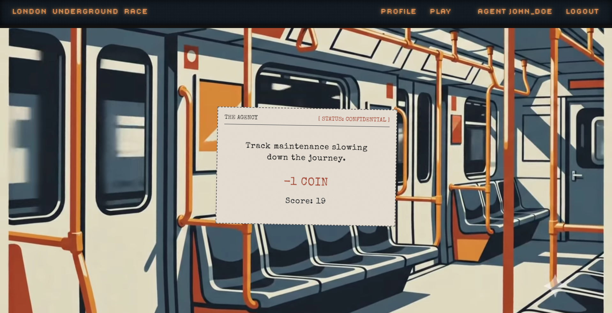
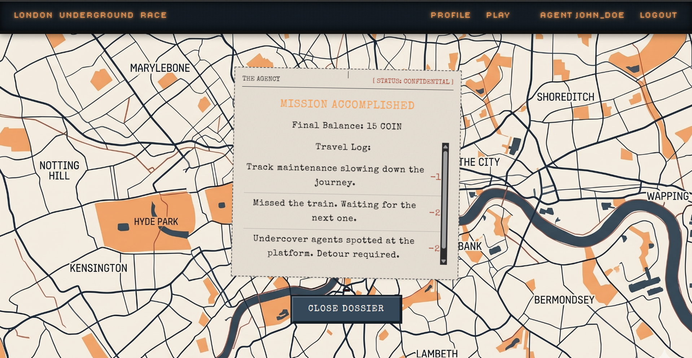
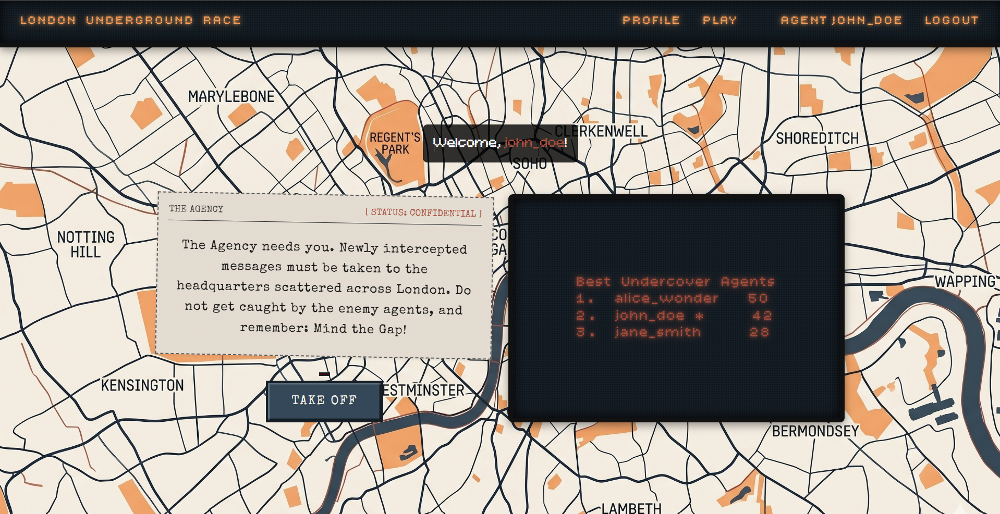

# Exam #1: "The last race"
## Student: s355068 MADARO Francesco Maria 

## React Client Application Routes

- Route `/`: page content and purpose
- Route `/something/:param`: page content and purpose, param specification
- ...

## API Server

- POST `/api/sessions`
  - request parameters: none
  - request body content: JSON object with `username` and `password`
  - response body content: JSON object containing the authenticated `user` info (e.g., `{ id, username }`)
- GET `/api/sessions/current`
  - request parameters: none (uses session cookie)
  - response body content: JSON object of the currently authenticated `user`
- DELETE `/api/sessions/current`
  - request parameters: none
  - response body content: empty body (terminates the session)
- GET `/api/network`
  - request parameters: none (requires authentication)
  - response body content: JSON array containing the list of all lines, stations, and their connections ordered by line and stop order.
- GET `/api/events`
  - request parameters: none (requires authentication)
  - response body content: JSON array of all possible random events, each with their `event_id`, `event_name`, `bonus`, and `weight`.
- GET `/api/games`
  - request parameters: none (requires authentication)
  - response body content: JSON array representing the leaderboard, containing the best `score` achieved by each `username`.
- POST `/api/games/setup`
  - request parameters: none (requires authentication)
  - request body content: none
  - response body content: JSON object containing a randomly generated valid route assignment, including `start` station, `end` station, and the `minDistance` (which is guaranteed to be >= 3).
- POST `/api/games/validate`
  - request parameters: none (requires authentication)
  - request body content: JSON object with `startId`, `endId`, and an array of `segments`, e.g., `{ "startId": 14, "endId": 7, "segments": [ { "startId": 14, "endId": 6 }, { "startId": 6, "endId": 7 } ] }`
  - response body content: JSON object containing the game result. If invalid, `{ "isValid": false, "error": "...", "finalScore": 0 }`. If valid, returns `{ "isValid": true, "events": [{ "step": 1, "segment": "Green Park -> Oxford Circus", "message": "Mind the gap!", "scoreChange": -1 }], "finalScore": 19 }`

## Database Tables

- Table `users` - contains users, with their ids, passwords.
- Table `games` - contains games played by users.
- Table `stations` - contains station names and their ids, to be better identified in the segment construction.
- Table `lines` - contains lines that are derived from lists of station ids
- Table `station_line` - contains correspondence between stations and lines, with their stop order to provide better segment checks
- Table `events` - contains events that are randomically picked to add/subtract user coins

## Main React Components

- `Play` in `Play.jsx`: manages the main game interface, including the map, segment selection, and submission timer.
- `DystopicMap` and `Map` in `DystopicMap.jsx` and `Map.jsx`: handle the visual rendering of the underground network and its stations.
- `Travel` in `Travel.jsx`: simulates the travel phase by applying random events and calculating the final score.
- `Result` in `Result.jsx`: displays the final mission report with the game outcome and a button to play again.
- `SegmentHandler` and `Segment` in `SegmentHandler.jsx` and `Segment.jsx`: allow the user to view and select individual line segments.
- `ProtectedRoute` in `ProtectedRoute.jsx`: wrapper component that blocks access to private routes for unauthenticated users.
- `UserProfile` in `UserProfile.jsx`: displays the user's profile details and their historical score leaderboard.
- `Home` in `Home.jsx`: application landing page containing the introductory mission dossier and the login button.
- `Login` in `Login.jsx`: handles the authentication form and logic to let the agent access the system.

## Screenshot
 
 
 

 

 
 

## Users Credentials

- `john_doe`:`password123`
- `jane_smith`:`password123`
- `alice_wonder`:`password123`
- `bob_builder`:`password123` (this user has no scores)

## Use of AI Tools
AI was used for debugging purpose and also to have a better understanding on how to manage a better design of the application. It was used to get help in designing UI features, and to adapt some parts of the required algorithms. Every feature was thought by myself, and all code was validated and checked carefully, to meet both correctness and efficiency requirements.
